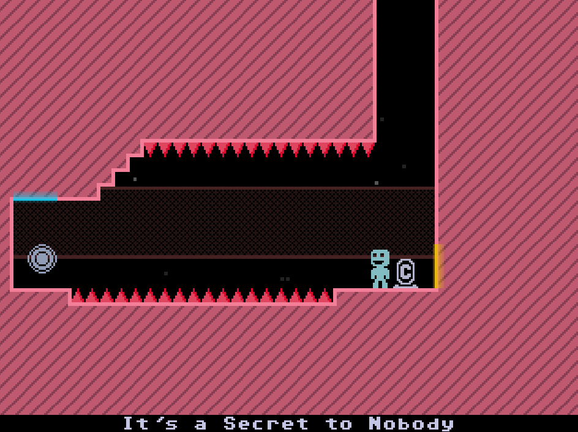

This is my fork of VVVVVV. It adds portal mechanics using the mouse. Levels are changed.



For more context about the original game source code release, see the [announcement](http://distractionware.com/blog/2020/01/vvvvvv-is-now-open-source/) on Terry's blog!

License
-------
VVVVVV's source code is made available under a custom license. See [LICENSE.md](LICENSE.md) for more details.

In general, if you're interested in creating something that falls outside the license terms, get in touch with Terry and we'll talk about it!

Original game authors
-------
- Created by [Terry Cavanagh](http://distractionware.com/)
- Room Names by [Bennett Foddy](http://www.foddy.net)
- Music by [Magnus Pålsson](http://souleye.madtracker.net/)
- Metal Soundtrack by [FamilyJules](http://familyjules7x.com/)
- 2.0 Update (C++ Port) by [Simon Roth](http://www.machinestudios.co.uk)
- 2.2 Update (SDL2/PhysicsFS/Steamworks port) by [Ethan Lee](http://www.flibitijibibo.com/)
- Beta Testing by Sam Kaplan and Pauli Kohberger
- Ending Picture by Pauli Kohberger

How do I build this?
------------
The building process is exactly the same as in the original game. If you can build VVVVVV, you _should_ be able to build this version too.

On Linux, it might be:

  - Libraries required: libsdl2 and libsdl-mixer
    - Use the ones with the headers, on Debian it's `sudo apt install libsdl2-dev libsdl2-mixer-dev`
    - Warning: you need libsdl2 >= 2.0.5. If your package manager can't give you that, I think the easiest is to compile libsdl2 and libsdl2-mixer yourself. Make sure that ogg and wav support is enabled.
  - Go to `desktop_version` and use Cmake:

```bash
cd desktop_version
mkdir build
cd build
cmake ..
make
```

  - You need to place `data.zip` in the same directory as the `VVVVVV` executable. You might get it here: [Make and Play](https://thelettervsixtim.es/makeandplay/)
